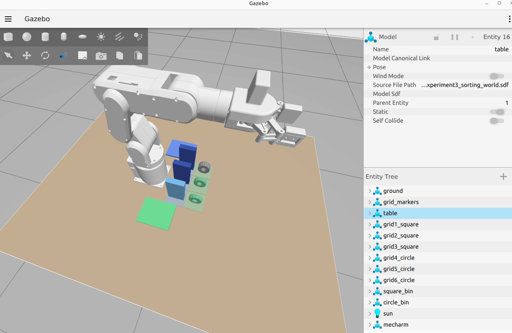
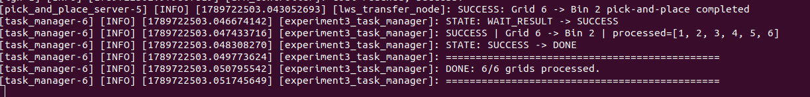
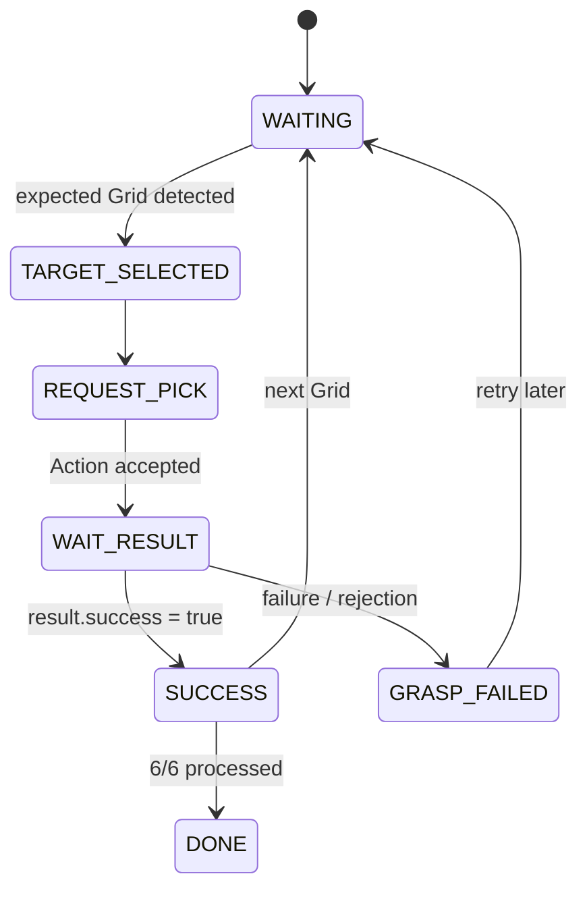
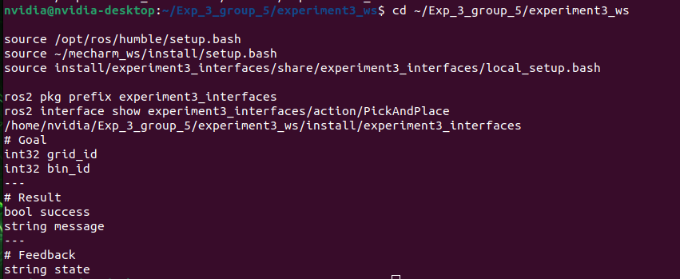
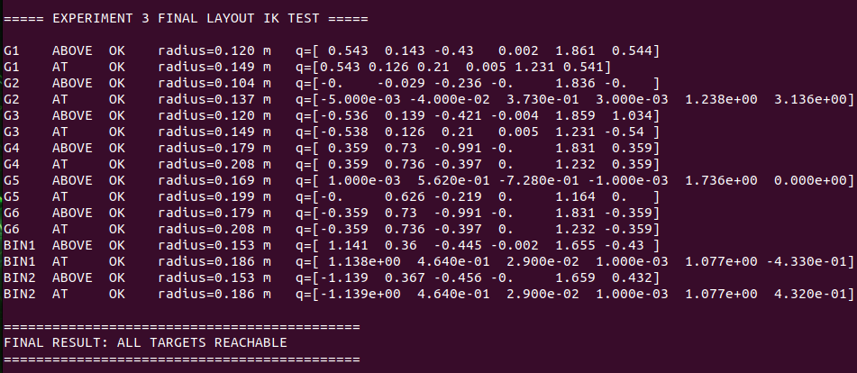
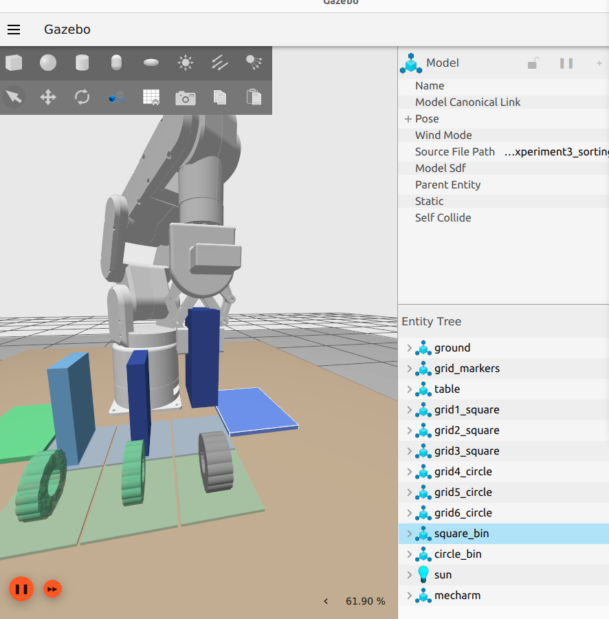
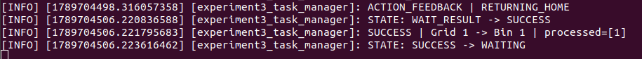
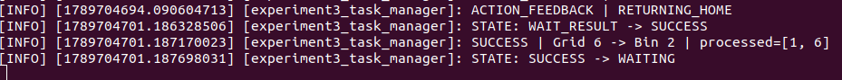
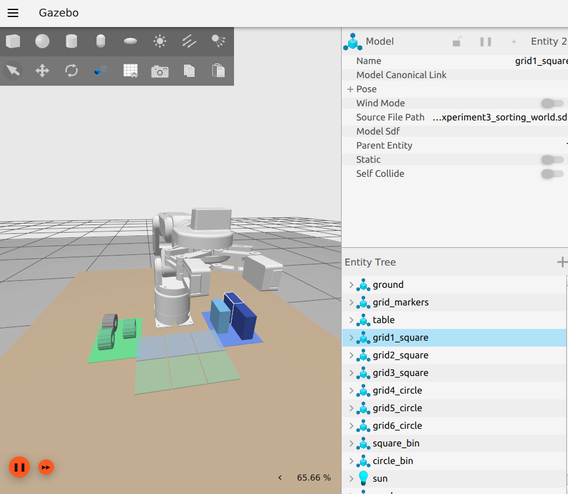
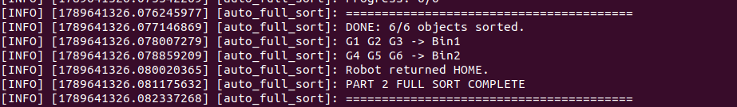

# Experiment 3 — Part 2: ROS 2 Task Control & mechArm270 Simulation

**Ocean University of China · Robotics Experiment · Group 5**  
**Part 2 owner:** Cao Jingwen · **Student ID:** 24020036005

This repository contains the **Part 2 simulation and task-control implementation** for Experiment 3: a vision-driven desktop sorting system using ROS 2 Humble, Gazebo/Ignition, YOLO detection, a state-machine task manager, and a simulated mechArm270 with adaptive gripper.

> **Scope note:** the YOLO detector package is included as the upstream **Part 1 dependency** required to reproduce the final Part 2 closed loop. Part 2 focuses on Grid/Bin decision, state control, ROS 2 Action integration, simulated manipulation, exception handling, and system integration.

<p align="center">
  
</p>

## Final Result

The final simulation completed all six pickup grids automatically:

```text
G1 -> Bin 1    G2 -> Bin 1    G3 -> Bin 1
G4 -> Bin 2    G5 -> Bin 2    G6 -> Bin 2

processed=[1, 2, 3, 4, 5, 6]
DONE: 6/6 grids processed.
```

<p align="center">
  
</p>

## What Part 2 Implements

- 6 fixed pickup Grids and 2 destination Bins
- `Square -> Bin 1`, `Circle -> Bin 2`
- Detection center -> calibrated Grid mapping
- Deterministic `G1 -> G2 -> G3 -> G4 -> G5 -> G6` scheduling
- ROS 2 task-manager state machine
- Custom `/pick_and_place` Action
- mechArm270 + adaptive-gripper simulation
- Grasp, lift, transport, release, retreat, and return HOME
- Unknown-class / invalid-target handling and execution logs
- One-launch integration of camera, detector, task manager, Action Server, robot, and controllers
- Full six-object closed-loop verification

## System Architecture


### Main ROS 2 interfaces

| Interface | Type | Purpose |
|---|---|---|
| `/experiment3_camera/image_raw` | `sensor_msgs/msg/Image` | Simulated RGB image |
| `/detections` | `vision_msgs/msg/Detection2DArray` | Part 1 detector output |
| `/pick_and_place` | `experiment3_interfaces/action/PickAndPlace` | Grid/Bin manipulation request |
| `/arm_controller/follow_joint_trajectory` | ROS 2 control Action | Arm trajectory execution |
| `/hand_controller/follow_joint_trajectory` | ROS 2 control Action | Gripper execution |

See [`docs/INTERFACES.md`](docs/INTERFACES.md) for the exact interface contract.

## Class and Bin Convention

The detector publishes the **Group 5 system convention**:

| Published class ID | Object | Final test Grids | Destination |
|---:|---|---|---|
| `0` | Square | G1–G3 | Bin 1 |
| `1` | Circle | G4–G6 | Bin 2 |

> The raw YOLO training-class order is different. The conversion is already performed inside `experiment3_vision/detector_node.py`; the task manager does not invert it again.

## Part 2 State Flow



## Final Simulation Grid Calibration

The final 640×480 camera uses an angled view, so Part 2 uses calibrated target centers rather than a naive equal 3×2 image split.

| Grid | u (px) | v (px) |
|---|---:|---:|
| G1 | 371.2 | 218.1 |
| G2 | 317.7 | 207.8 |
| G3 | 268.0 | 194.5 |
| G4 | 347.8 | 256.6 |
| G5 | 290.9 | 242.3 |
| G6 | 242.6 | 227.5 |

For a detected center `(x, y)`, the task manager associates it with the nearest valid calibrated Grid center.

## Repository Structure

```text
Experiment3-Part2/
├── README.md
├── .gitignore
├── requirements.txt
├── docs/
│   ├── INTERFACES.md
│   └── Experiment3_CaoJingwen_Personal_Report.pdf
├── evidence/
│   └── screenshots/
└── src/
    ├── experiment3_interfaces/       # PickAndPlace.action
    ├── experiment3_task_manager/     # Detection -> Grid -> Bin -> Action
    ├── experiment3_arm_sim/          # Gazebo world, arm Action Server, launch
    ├── experiment3_vision/           # Part 1 detector dependency + final model
    └── mycobot_description/          # Minimal required third-party mesh assets
```

## Important Files

| File | Role |
|---|---|
| `src/experiment3_task_manager/experiment3_task_manager/task_manager_node.py` | Part 2 state machine, Grid mapping, class-to-bin decision |
| `src/experiment3_interfaces/action/PickAndPlace.action` | Task/arm interface |
| `src/experiment3_arm_sim/experiment3_arm_sim/pick_and_place_server.py` | Simulated manipulation Action Server |
| `src/experiment3_arm_sim/launch/experiment3_sim.launch.py` | One-launch final integration |
| `src/experiment3_arm_sim/worlds/experiment3_sorting_world.sdf` | Final six-object sorting world |
| `src/experiment3_arm_sim/config/sorting_params.yaml` | Grid/Bin positions and motion parameters |
| `src/experiment3_vision/experiment3_vision/detector_node.py` | Upstream YOLO detection dependency |
| `src/experiment3_vision/weights/best.pt` | Final detector weights used in the simulation |

## Build

Tested with **Ubuntu 22.04 + ROS 2 Humble + Gazebo Fortress/Ignition**.

Create or clone the repository as a ROS 2 workspace root, then install the Python detector dependency:

```bash
cd Experiment3-Part2
python3 -m pip install -r requirements.txt

source /opt/ros/humble/setup.bash
colcon build --symlink-install
source install/setup.bash
```

The system also requires the normal ROS 2 Humble packages for `ros_gz_bridge`, `ros_gz_sim`, `gz_ros2_control`, `ros2_control`, `ros2_controllers`, `vision_msgs`, `cv_bridge`, `robot_state_publisher`, and `xacro`.

## Run the Final Part 2 Simulation

```bash
cd Experiment3-Part2
source /opt/ros/humble/setup.bash
source install/setup.bash

ros2 launch experiment3_arm_sim experiment3_sim.launch.py
```

The launch starts the Gazebo world, RGB bridge, YOLO detector, PickAndPlace Action Server, task manager, robot-state publisher, robot spawn, arm controller, and gripper controller.

### Expected terminal result

```text
SUCCESS | Grid 6 -> Bin 2 | processed=[1, 2, 3, 4, 5, 6]
STATE: SUCCESS -> DONE
DONE: 6/6 grids processed.
```

## Evidence Gallery

### ROS 2 Action and reachability

| PickAndPlace Action | All targets reachable |
|---|---|
|  |  |

### Grasping and closed-loop task execution

| Simulated grasp and lift | Square closed-loop success |
|---|---|
|  |  |

| Circle closed-loop success | Final sorting scene |
|---|---|
|  |  |

### Full six-object mechanical sorting milestone

<p align="center">
  
</p>

## Motion Parameters Used in the Final Demo

From `sorting_params.yaml`:

```text
arm_move_time     = 4.0 s
gripper_move_time = 1.2 s
gripper_open      = 0.0
gripper_close     = -0.44
safe_height       = 0.080 m
```

Critical approach/return motions remain conservative for stable grasping.

## Report

The final personal lab report is included here:

[`docs/Experiment3_CaoJingwen_Personal_Report.pdf`](docs/Experiment3_CaoJingwen_Personal_Report.pdf)

It documents the Part 2 requirements, individual responsibilities, implementation principles, troubleshooting process, results, and personal reflection.

## Third-Party Robot Assets

`src/mycobot_description` is a **minimal coursework snapshot** containing only the mechArm270 Pi and adaptive-gripper mesh assets required by this simulation. These assets originate from Elephant Robotics and retain the included **BSD 2-Clause License**.

## Notes

- This repository intentionally excludes `build/`, `install/`, `log/`, large recordings, intermediate model backups, `__pycache__`, and later Part 3/Part 4 real-robot modifications.
- The included task manager represents the **Part 2 simulation calibration (640×480)** and the final G1→G6 simulation scheduling logic.
- The simulation recording is not tracked in GitHub to keep the repository lightweight; the screenshot evidence and report document the final run.

---

**Experiment 3 · Group 5 · Part 2 — Task Control and Robotic Arm Simulation**
